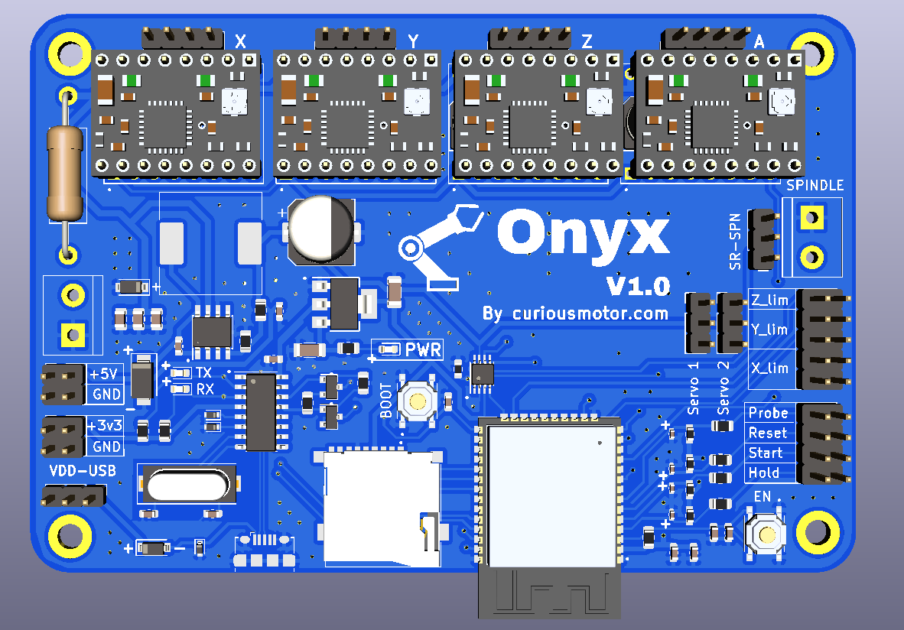

# Onyx-Stepper-Motherboard
The successor of the iconic Arduino-CNC-shield

The Arduino UNO + CNC shield has been the go-to setup for several CNC machines, robotic arms, drawing machines and what not! It's about time we replace the 8-bit microcontroller, with a powerful 32-bit, Wifi + BLE enabled ESP32!

This project builds upon pioneering work done by GitHub user Bdring.

## Features

1. Control upto 4 stepper motors
2. Supports all stepper drivers in STEP/DIR mode (A4988, DRV8825, TMC2208, TMC2209, TMC2130)
3. 5V PWM outputs x 3
4. Limit switch ports x 3 (X, Y and Z Axes)
5. 12/24V input power supply port
6. Wifi + BLE support (Thanks to GRBL_ESP32)
7. MicroSD card Support
